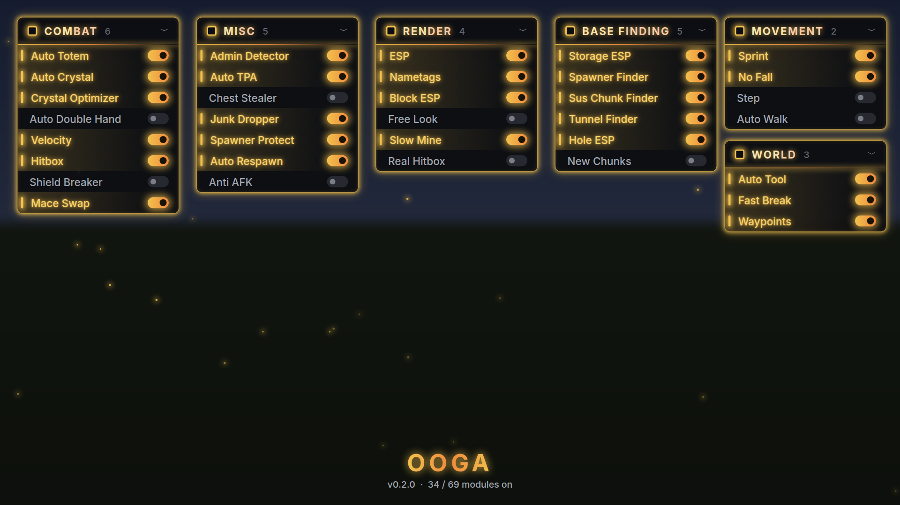
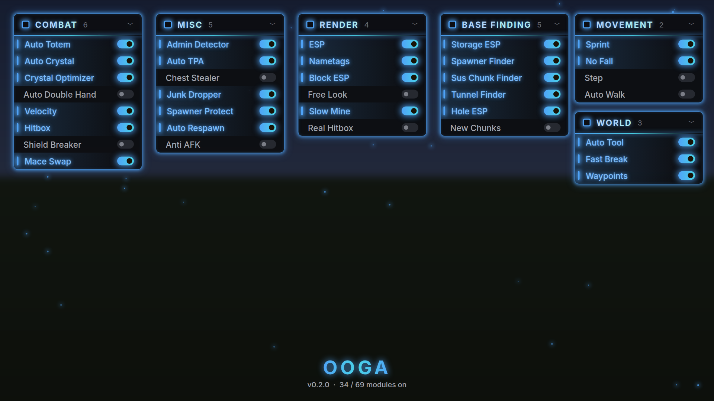
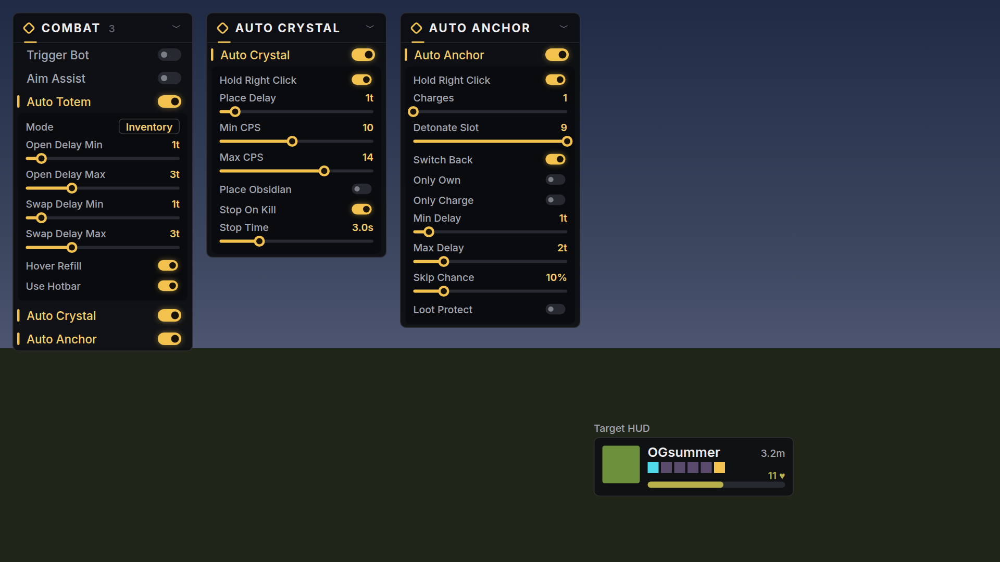
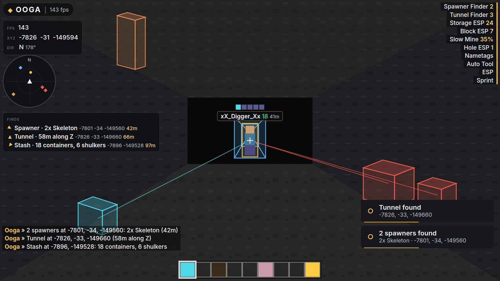
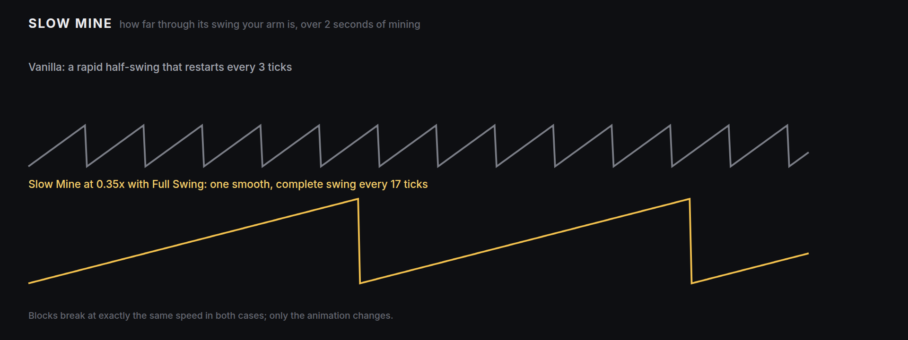
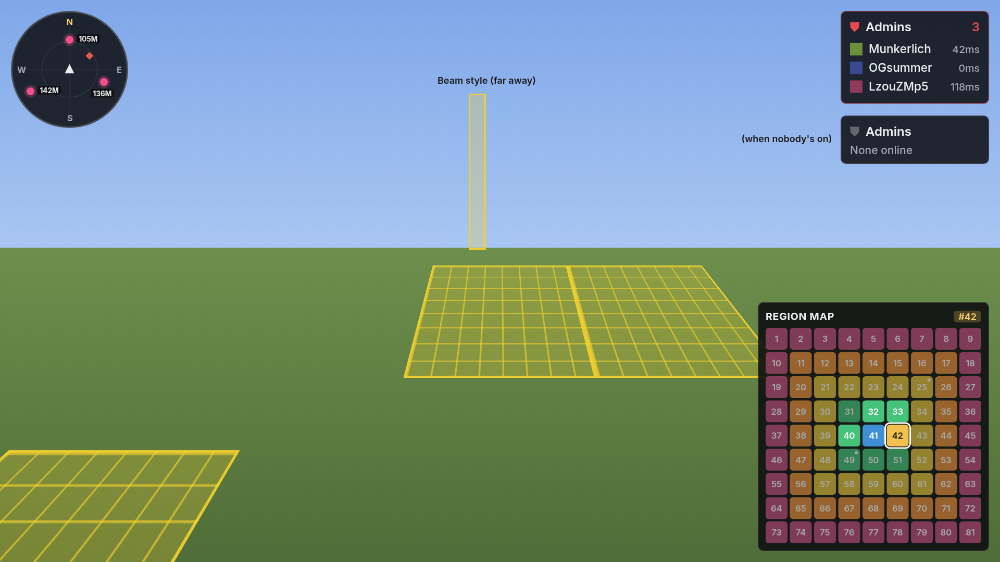

# Ooga-Client

A Fabric utility client for **Minecraft 1.21.11** with its own visual identity: a dark
charcoal UI with a restrained, sophisticated gold accent and a soft golden glow.

## Preview









These are rendered offline from the real UI code by a stand-in renderer (Inter via Java2D),
so text anti-aliasing differs slightly from in-game.

## Building

Requires Java 21.

```
./gradlew build
```

The mod jar lands in `build/libs/`. Drop it, together with
[Fabric API](https://modrinth.com/mod/fabric-api) for 1.21.11, into `.minecraft/mods`.

## Using it

| Action | Default |
| --- | --- |
| Open the menu | `Right Shift` |
| Toggle a module | Left-click its row |
| Show a module's settings | Right-click the row |
| Bind a key | Middle-click the row, then press a key; `Esc`/`Backspace` unbinds |
| Move / collapse a panel | Drag its header / click the chevron (or right-click the header) |
| Switch layout | ClickGUI settings → Layout: Panels (default) or Window |
| Search | Just start typing (or `Ctrl+F`); `Enter` toggles the top result |
| Reset a slider | Right-click its label |
| Move HUD elements | **Edit HUD** in the menu header; scroll over an element to resize |

Settings are saved automatically to `config/ooga/config.json`.

### Look and feel

Client Settings → **Accent** picks the colour of everything: Gold, Amber, Honey, Champagne,
Lemon, Ocean, Violet, Rose, Mint, Crimson, or **Chroma** (slowly cycles through every hue).
Each accent has a second colour used for gradients.

Glow is real soft light (a blurred sprite, not stepped rings) with **Bloom** blending. It sits
on the UI itself: neon panel borders (**Panel Glow**), glowing header titles and icons,
glowing names and toggles on enabled modules. The menu blurs the world and has floating
**Particles**; an optional **Aurora** of drifting light is off by default. Tune it with Glow
Intensity / Radius / Pulse, or switch Glow Style to Classic.

### Chat commands

Type these in chat; they never reach the server.

| Command | What it does |
| --- | --- |
| `.help` | List commands |
| `.toggle <module>` | Turn a module on or off |
| `.bind <module> <key>` | Bind a key (`none` unbinds) |
| `.set <module> <setting> <value>` | Change a setting (use_underscores for spaces) |
| `.friend add/remove/list <name>` | Manage friends |
| `.wp add [name]` / `del <name>` / `list` / `clear` | Waypoints here |
| `.finds [clear]` | List or forget recent finds |
| `.coords` | Copy your coordinates |
| `.modules` | List modules that are on |

### Base finding

| Module | What it does |
| --- | --- |
| Storage ESP | Chests, shulkers, barrels, ender chests, hoppers and more through walls, colour-coded by kind, with optional tracers. **Stash Alert** announces any chunk holding lots of containers |
| Spawner Finder | Names each spawner's mob, groups spawners that load together into one alert ("4 spawners: 3x Skeleton, Zombie"), and tells placed spawners (red) from dungeon/mineshaft/fortress ones (brown). **Hide Natural** skips the generated ones |
| Tunnel Finder | Long, straight 1x2 corridors of plain air with solid walls, floor and ceiling: player-dug tunnels. Measured across chunk borders; long ones are announced |
| Hole ESP | 1x1 vertical shafts (air or ladders, walled on all four sides) that players dig straight down to hidden bases |
| New Chunks | Marks chunks the server just generated (flowing-liquid updates right after load), so old, explored land stands out |
| Sus Chunk Finder | Scores chunks for player-placed blocks (hoppers, observers, pistons, shulkers, beacons…) and fully grown kelp, which only grows while a chunk stays loaded; flagged chunks are announced and drawn as a gridded square, a plain square, or a tall beam (yellow, pink or accent) |
| Light Finder | Torches and lanterns below a set height, where caves generate none |
| Finder Alerts | Shared settings: a ping sound for every find, and a log of all finds (time, server, dimension, coordinates) in `config/ooga/finds.log` |
| Finds (HUD) | The last few finds in this dimension, with coordinates, distance and an arrow pointing to each |
| Radar (HUD) | A rotating minimap with N/E/S/W on the rim: players as dots with distance (or name) tags, optionally hostiles, and every find as a coloured marker |
| Region Map (HUD) | A numbered grid of world regions (size, grid and centre are configurable) with your region highlighted, its number in the header, visited regions brighter and regions with finds marked |
| Admin Detector (Misc) | An **Admins** panel listing staff online with face and ping, or "None online". Staff = a staff rank in their tab name or team prefix, spectator mode (vanished staff), or a name in `config/ooga/staff.txt`. Chat + notification + sound when staff join or leave |

Finders scan chunks in the background a few per tick, so enabling them never stalls the game.
When blocks change (mined, placed, liquids flowing) the chunk is rescanned once it settles, so
results stay current.

### Render and utility

| Module | What it does |
| --- | --- |
| ESP | Players, hostiles, passive mobs and items through walls. **Style**: Glow (vanilla-style outline), Box, or Both |
| Nametags | Tags over players (and optionally hostiles) through walls: name, health, distance, held item and armour. Hides the vanilla tags it replaces |
| Block ESP | Diamonds, ancient debris, emeralds, gold, nether portals, end portal frames, beacons and budding amethyst through walls, nearest first |
| Tracers | Lines to nearby players, optionally hostile mobs |
| Slow Mine | Mine at normal speed while your hand swings in slow motion. **Speed** sets how slow (35% by default); **When** picks mining only or every swing; **Full Swing** plays each swing all the way through. Purely visual |
| Free Look | Orbit a third-person camera around yourself while you keep moving straight. With **Hold Key**, it lasts as long as you hold its keybind |
| Freecam | Detached flying camera. Scroll to change speed. **Stay Sneaking** keeps your parked body crouched if you were sneaking; **Steady View** turns off view bobbing and FOV effects while flying; it lands itself if you respawn or change dimension |
| Zoom, Fullbright | Spyglass zoom, see in the dark |
| Auto Tool (World) | Switches to the fastest hotbar tool for the block you're mining, skipping nearly broken ones, and back when you stop |
| Sprint (Movement) | Always sprint |

### Combat

| Module | What it does |
| --- | --- |
| Trigger Bot | Attacks the entity under your crosshair once your attack has recharged (charge threshold and a small random delay are configurable) |
| Aim Assist | Smoothly pulls your aim toward the nearest target within a FOV cone, eased per frame |
| Auto Totem | Refills your offhand with a totem after one pops. **Inventory** mode (default) opens your inventory, swaps the totem in and closes it again, each step after a random delay in the range you set; **Instant** swaps without opening anything. **Hover Refill** also refills while you have your inventory open yourself |
| Velocity | Take less (or no) knockback from hits and explosions |
| Crystal Optimizer | Crystals disappear the moment you hit them, so the next one goes down faster |
| Auto Double Hand | Holds a totem in your main hand when you're low or explosives are close |
| Hitbox | Grows other players' (optionally mobs') pick area so they're easier to hit |
| No Hit Delay | Removes the 10-tick lockout after swinging at air |
| Shield Breaker | Hitting someone who's blocking swaps to an axe for that hit to disable their shield, then back |
| Mace Swap | Attacking mid-fall swaps to your mace for the smash hit, then back |
| Auto Jump Reset | Jumps the moment a hit lands on the ground to take less knockback |
| Elytra Swap | One key swaps between elytra and your best chestplate |
| Auto Crystal | Hold right click with end crystals: places a crystal on the obsidian you aim at and breaks crystals under your crosshair at a random speed between Min and Max CPS. Can put obsidian down first, and pauses after a nearby kill so loot survives |
| Auto Anchor | Look at a respawn anchor while holding right click: charges it with glowstone, switches to your detonate slot, blows it and picks anchors back up. Random delays between steps plus a skip chance; Only Own / Only Charge / Loot Protect options. Anchors only explode outside the Nether |

### Misc

| Module | What it does |
| --- | --- |
| Admin Detector | See the base-finding table above |
| Name Protect | Replaces your username in everything drawn on screen (chat, tab, scoreboard, tags), for recordings |
| Auto Reconnect | Reconnect button on the disconnect screen, plus an automatic countdown while enabled |
| Auto Log | Disconnects on low health, when staff come online, or when a player gets close; then turns itself off |
| Auto Eat | Eats the best hotbar food when hunger drops, skipping bad food |
| Fast Place | Shortens the delay between placements |
| Auto Clicker | Clicks at a random CPS while you hold attack (entities only by default) |
| Auto Firework | Fires hotbar rockets while gliding whenever you slow down |
| Auto Mine | Holds attack for you while you look at a block |
| Cord Snapper | One key copies your coordinates to the clipboard |
| Friends (Client) | Middle-click players to befriend them: combat modules leave them alone and ESP, nametags and radar show them green. Saved in `config/ooga/friends.txt` |
| Real Hitbox (Render) | Shows true hitboxes, eye height and look direction (and the expanded Hitbox area) |
| Waypoints (World) | Glowing beams and on-screen labels with distance. Its keybind drops a waypoint; your death point is saved automatically. Per server and dimension |
| Auto Respawn | Skips the death screen |
| Anti AFK | Small random actions so you don't get kicked for idling |
| Inventory / Armor / Potion HUD | Your inventory; armour and tool durability; active effects with time left |
| Auto TPA | Accepts teleport requests (friends only by default) |
| Chest Stealer | Empties chests, barrels and shulkers you open, with random delays |
| Junk Dropper | Drops stone, dirt, netherrack and other mining junk automatically |
| Spawner Protect | Alerts you (or logs you out) when a non-friend comes near spawners you're at |
| No Fall / Step / Auto Walk (Movement) | No fall damage; walk up blocks; keep walking forward |
| Fast Break (World) | No pause between blocks when mining |
| Key Pearl | Bind a key to throw an ender pearl (or wind charge) from anywhere in your hotbar |
| Target HUD (HUD) | Face, name, smooth health bar, distance and gear of whoever you're fighting |

### Music widget

The **Music** HUD module shows what's playing in any system media player: Spotify,
browsers, Apple Music and so on. Open chat to click its previous, play/pause and next buttons.

| OS | Source |
| --- | --- |
| Windows 10/11 | System media session (the one the volume flyout shows), via PowerShell |
| macOS | Spotify, then Apple Music, via AppleScript |
| Linux | Any MPRIS player via `playerctl` (install it from your package manager) |

## Layout

```
src/main/java/dev/ooga/client
├── OogaClient.java          entrypoint; wires modules → notifications, HUD, config
├── module/                  Module, Category, ModuleManager, settings
│   └── impl/                basefinding · client · movement · render · world modules
├── config/                  debounced JSON persistence
├── camera/                  CameraController, CameraMode, FreeCamera, OrbitCamera,
│                            FirstPersonRenderer, PlayerControlLock
├── world/                   ChunkScanner, BlockEntityTracker, BlockUpdates, Finds
├── render/                  WorldOverlay (see-through boxes and lines), Projector (world → HUD)
├── ui/
│   ├── OogaTheme.java       colour, radius and spacing tokens
│   ├── render/              Render2D (pixel-exact shapes), GlowRenderer, OogaFonts, Icon
│   ├── clickgui/            the menu and its widgets
│   ├── hud/                 watermark, module list, info, keystrokes, finds, radar, HUD editor
│   └── notify/              toast notifications
└── mixin/                   the only code that touches Minecraft internals
```

The UI typeface is [Inter](https://rsms.me/inter/) (SIL Open Font License, see
`assets/ooga/font/INTER_LICENSE.txt`).
