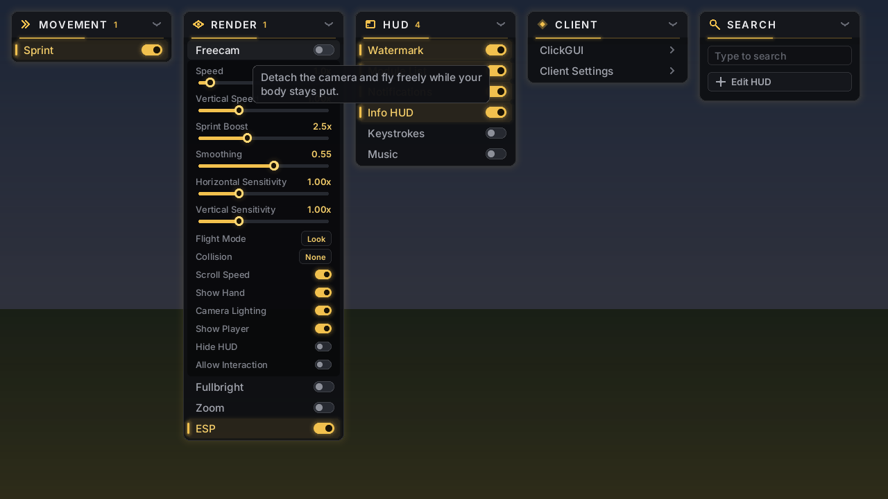
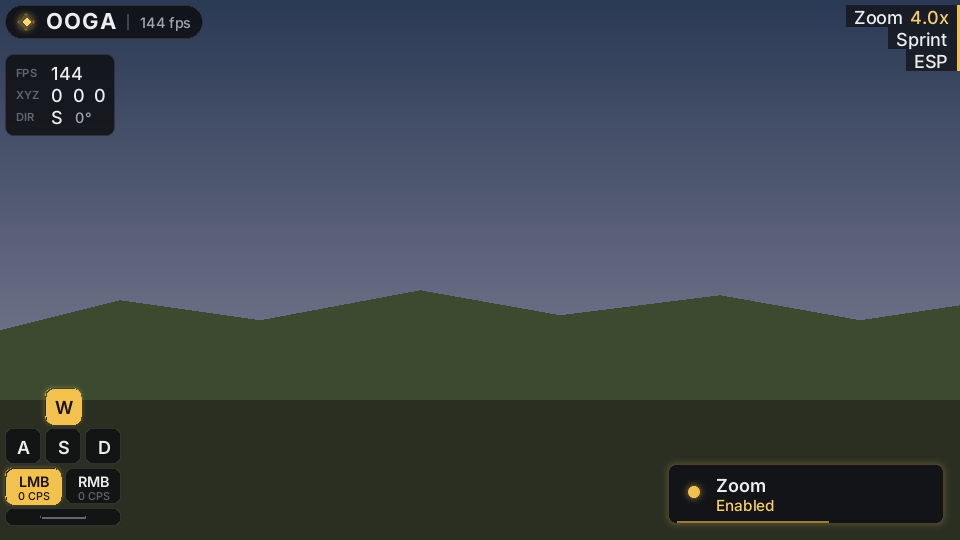

# Ooga-Client

A Fabric utility client for **Minecraft 1.21.11** with its own visual identity: a dark
charcoal UI with a restrained, sophisticated gold accent and a soft golden glow.

## Preview




These are rendered offline from the real UI code by a stand-in renderer (Inter via Java2D),
so text anti-aliasing differs slightly from in-game.

## Building

Requires Java 21.

```
./gradlew build
```

The mod jar lands in `build/libs/`. Drop it, together with
[Fabric API](https://modrinth.com/mod/fabric-api) for 1.21.11, into `.minecraft/mods`.

## Using it

| Action | Default |
| --- | --- |
| Open the menu | `Right Shift` |
| Toggle a module | Left-click its row |
| Show a module's settings | Right-click the row |
| Bind a key | Middle-click the row, then press a key; `Esc`/`Backspace` unbinds |
| Move / collapse a panel | Drag its header / click the chevron (or right-click the header) |
| Switch layout | ClickGUI settings → Layout: Panels (default) or Window |
| Search | Just start typing (or `Ctrl+F`); `Enter` toggles the top result |
| Reset a slider | Right-click its label |
| Move HUD elements | **Edit HUD** in the menu header; scroll over an element to resize |

Settings are saved automatically to `config/ooga/config.json`.

### Music widget

The **Music** HUD module shows what's playing in any system media player: Spotify,
browsers, Apple Music and so on. Open chat to click its previous, play/pause and next buttons.

| OS | Source |
| --- | --- |
| Windows 10/11 | System media session (the one the volume flyout shows), via PowerShell |
| macOS | Spotify, then Apple Music, via AppleScript |
| Linux | Any MPRIS player via `playerctl` (install it from your package manager) |

## Layout

```
src/main/java/dev/ooga/client
├── OogaClient.java          entrypoint; wires modules → notifications, HUD, config
├── module/                  Module, Category, ModuleManager, settings
│   └── impl/                client · movement · render modules
├── config/                  debounced JSON persistence
├── camera/                  CameraController, CameraMode, FreeCamera,
│                            FirstPersonRenderer, PlayerControlLock
├── ui/
│   ├── OogaTheme.java       colour, radius and spacing tokens
│   ├── render/              Render2D (pixel-exact shapes), GlowRenderer, OogaFonts, Icon
│   ├── clickgui/            the menu and its widgets
│   ├── hud/                 watermark, module list, info, keystrokes, HUD editor
│   └── notify/              toast notifications
└── mixin/                   the only code that touches Minecraft internals
```

The UI typeface is [Inter](https://rsms.me/inter/) (SIL Open Font License, see
`assets/ooga/font/INTER_LICENSE.txt`).
